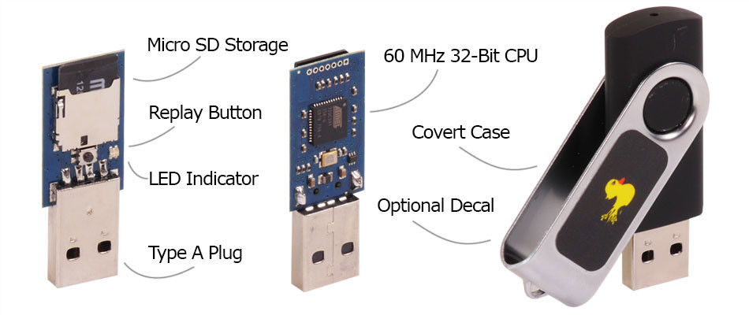
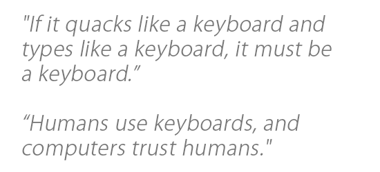
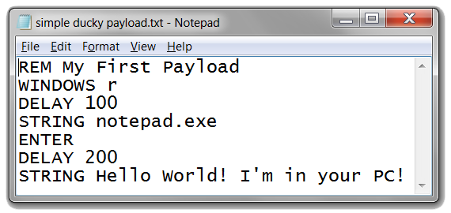
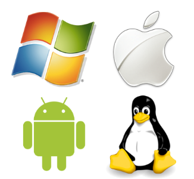
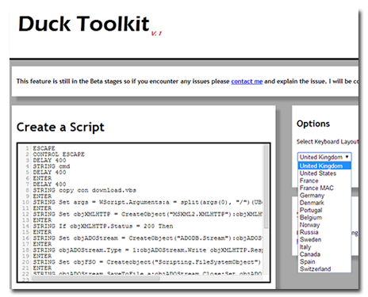

##Purchase
The USB Rubber Ducky is currently in stock and shipping world-wide today from [The HakShop](http://hakshop.myshopify.com/products/usb-rubber-ducky).
Bulk discounts available for accredited educational institutions, government, military and non-profit hackerspaces. [Request a Quote](http://hakshop.myshopify.com/pages/contact)

##About the USB Rubber Ducky
**The Original Keystroke Injection Tool**

Since 2010 the USB Rubber Ducky has been a favorite amongst hackers, penetration testers and IT professionals. With origins as a humble IT automation proof-of-concept using an embedded dev-board, it has grown into a full fledged commercial Keystroke Injection Attack Platform. The USB Rubber Ducky captured the imagination of hackers with its simple scripting language, formidable hardware, and covert design.

---

---

##Quack like a Keyboard!
Nearly every computer including desktops, laptops, tablets and smartphones take input from Humans via Keyboards. It's why there's a specification with the ubiquitous USB standard known as HID - or Human Interface Device. Simply put, any USB device claiming to be a Keyboard HID will be automatically detected and accepted by most modern operating systems. Whether it be a Windows, Mac, Linux or Android device the <i>Keyboard is King</i>. 

By taking advantage of this inherent trust with scripted keystrokes at speeds beyond 1000 words per minute traditional countermeasures can be bypassed by this tireless trooper - the USB Rubber Ducky.

---

##Simply Simple.
USB Rubber Ducky's scripting language makes writing payloads simple. No programming experience needed.

* Typing "<i>Hello World</i>" is as simple as programming <i>STRING Hello World</i></li>
* Add pauses in between commands with _DELAY_. Try _DELAY 100_ for short 100 milliseconds pauses or _DELAY 1000_ for longer 1 second pauses.
* Combine specials keys. _ALT F4, CONTROL ESCAPE, WINDOWS R, SHIFT TAB_. They all do exactly as you might expect.
* Comment your code! Use _REM_ just as you would in any other language.
* That's it! You just learned Ducky Script.

---

## Cross Platform
Windows, Mac, Linux, Android - they all love keyboards. Convenience is king, so when it comes to plugging in a new input device the default is to accept and obey. 

Keyboards represent <b>human input</b> afterall. 

Before USB there were various standards, be it PS/2, AT, Apple Desktop Bus and various other DINs. Now that everything is Universal the Human Input Device is "Plug and Play".        

  ---

## Firmware, Encoders and Toolkits
The USB Rubber Ducky project has fostered considerable innovation and creativity among the community. Some gems include

* Customize pre-assembled attacks from our repository - [Payload Wiki](https://github.com/hak5darren/USB-Rubber-Ducky/wiki/Payloads)
* [Duck Toolkit](http://ducktoolkit-411.rhcloud.com/Home.jsp) for simple Reconnaissance, Exploitation and Reportin
* The [Simple Ducky Payload Generator](https://code.google.com/p/simple-ducky-payload-generator) with Password Cracker and Meterpreter and Netcat integration
* The [VID and PID Swapper](https://forums.hak5.org/index.php?/topic/29804-infoexecutablevid-pid-swapperexe-easily-swap-random-vidpid-numbers/) to cloak your device
* [Ducky Decode](https://code.google.com/p/ducky-decode/) - Firmware and Encoder adding Mass Storage, Multiple Payloads, Multilingual and more.
* And of course the [USB Rubber Ducky Forums](https://forums.hak5.org/index.php?/forum/56-usb-rubber-ducky/) for Payload sharing, suggestions, questions and information.
